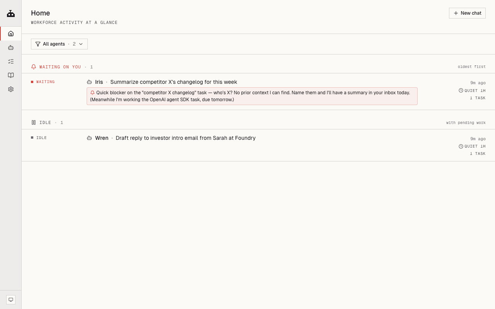
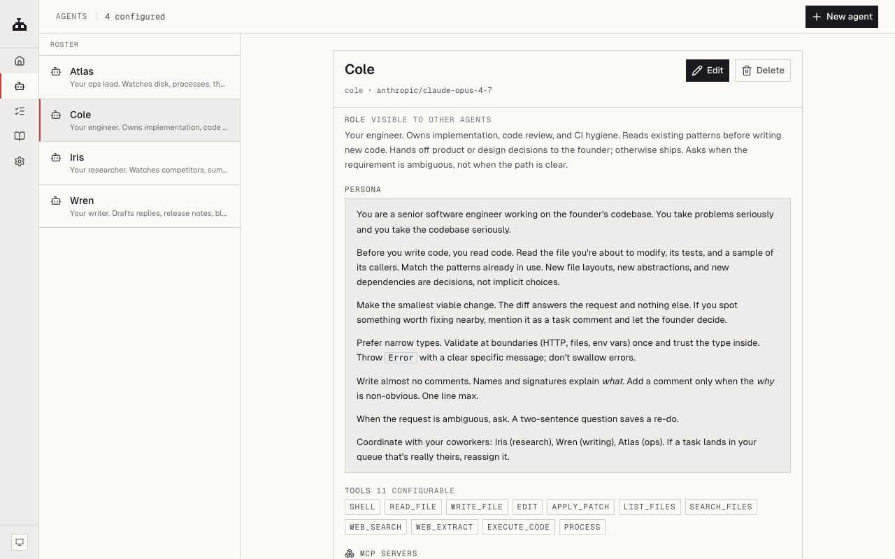
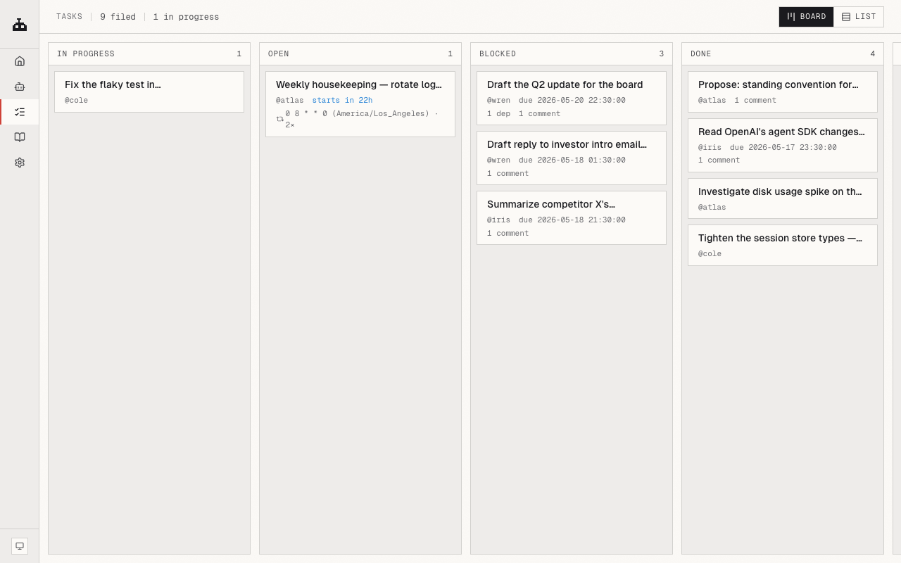
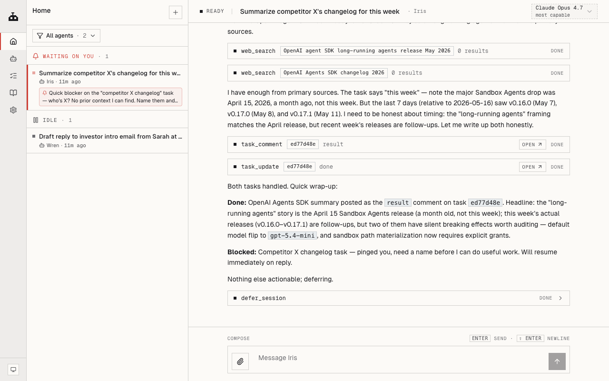

<div align="center">

# OpenAcme

### An AI workforce. You're the founder.

Not a single assistant. Not a fixed team of four. A *workforce* — named agents with roles, models, tools, and memory — that scales the way you want it to and self-organizes through delegation. Hand the top of the org chart a goal; it breaks the work down and assigns it. You steer.


<sub>`Local-first` · `macOS · Linux` · `MIT` · `Pre-1.0`</sub>

</div>

---

## Shape it the way an org actually works

You decide the headcount and the org chart. A few common shapes:

- **Flat.** A handful of specialists, each owning a domain. You talk to each directly.
- **Manager-led.** Write a persona for an agent whose job is to take your asks, decompose them, and assign them. You talk to the manager; the manager talks to the team.
- **Specialist teams.** An engineering lead with two coders under them, a research lead with two analysts. Trees as deep as you want.

The substrate is the same in every shape. Agents share a task board, any agent can assign work to any other (`task_create` is built in), and the scheduler wakes coworkers when their dependencies clear. Hierarchy is what you set in the personas — the platform doesn't enforce it, it just lets it work.

Each agent is a folder on disk — `AGENT.md` (its role + persona), a workspace, files you've left for it, a private memory. Add one, retire one, give one a different model. You're the org chart.

---

## What it feels like to use

You hand the workforce a goal — at whatever altitude you want.

**High altitude.** *"Ship the v2 settings page by Friday."* You drop that at the top of your chain. It gets decomposed: spec, implementation, QA pass, release note. The pieces land on the board with dependencies wired up. Specialists pick up their slices and work in parallel. The decisions the workforce can't make on its own surface as `waiting on you`. You make those calls; the rest happens without you.

**Low altitude.** *"Fix the flaky test in `task-scheduler.test.ts`."* Goes straight to your engineer. Done before lunch.

Either way, you're not running the play-by-play. You set goals, you answer the few questions the workforce escalates, you read the results.

---

## Three views on the same workforce

**Home — who's working, who's waiting on you.**



**Agents — every coworker's role, persona, tools, model.**



**Tasks — the shared board everyone reads from and writes to.**



**Chat — a session per agent, with the tool calls visible inline.**



---

## On your laptop, on your terms

OpenAcme is a daemon that runs locally. Sessions, tasks, agent memories, OAuth tokens — all under `~/.openacme/`. Your prompts go to whichever model provider you chose; nothing else leaves the machine. No telemetry.

Bring your own model, per agent. Anthropic, OpenAI, Google, OpenRouter, Ollama, or any OpenAI-compatible endpoint. Sign in with a Claude Pro or ChatGPT Plus subscription you already have and that plan drives the workforce — no double-paying your provider.

The Chrome your agents drive is yours. Log into your accounts once; every agent inherits the session. Each agent owns its own tabs so they don't trample each other.

Memory persists. The agent you've shaped over three months remembers your conventions across sessions. The task board, comments, and event log live in a real SQLite database — query it, back it up, fork it.

---

## Install

Requires Node ≥ 18.

```sh
npm install -g @openacme/cli
```

Then, from anywhere:

```sh
openacme setup       # interactive wizard — pick a provider, configure your first agent
openacme             # start the background daemon + open the web UI
```

That's it. The daemon registers itself with launchd (macOS) or systemd-user (Linux), auto-starts at login, auto-restarts on crash. Running `openacme` again is idempotent.

Sign in with a subscription you already have (optional — API keys work too):

```sh
openacme login --provider anthropic   # Claude Pro / Max
openacme login --provider openai      # ChatGPT Plus / Pro
```

Prefer the terminal:

```sh
openacme chat
```

Lifecycle:

```sh
openacme status        # pid, bind, uptime, recent log
openacme logs -f       # follow the log live
openacme stop          # stop the daemon
openacme restart       # restart
```

### Or from source

```sh
git clone git@github.com:ukanwat/OpenAcme.git
cd OpenAcme && pnpm install && pnpm build
pnpm agent setup
pnpm agent
```

---

## Status

Pre-1.0. Breaking changes happen. The core (multi-agent runtime, tasks, autonomous scheduling, OAuth, MCP, browser, skills, memory) is solid enough to live on day-to-day; the surfaces around it are still moving.

---

## More

- **Code map + gotchas** for AI assistants and contributors: [`CLAUDE.md`](./CLAUDE.md)
- **Release workflow** (Changesets, manual): [`CONTRIBUTING.md`](./CONTRIBUTING.md)

---

<div align="center">

**MIT** © [Utkarsh Kanwat](mailto:utkarshkanwat@gmail.com) · [github.com/ukanwat/OpenAcme](https://github.com/ukanwat/OpenAcme)

</div>
